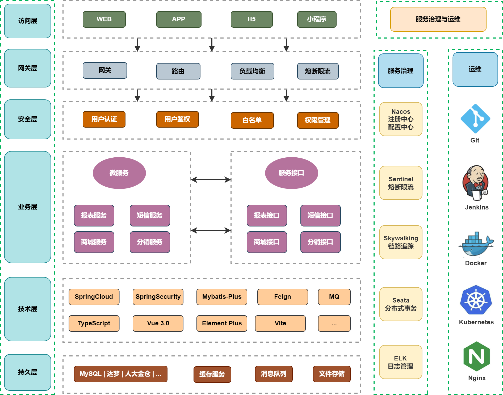

## 项目说明
- syzl-cloud 是采用SpringCloud Alibaba 2022、SpringCloud 2022、SpringBoot 3.1、SpringSecurity 6.1、Nacos、Mybatis-Plus、Redis等框架，开发的一套SpringCloud低代码开发平台，使用门槛极低，且采用MIT开源协议，完全免费开源，可免费用于**商业项目**等场景。
  
## 支持
如果觉得框架还不错，或者已经在使用了，希望你可以去 [Github](https://github.com/ouyanghf/syzl-cloud-exam)  帮作者点个 ⭐ Star，这将是对作者极大的鼓励与支持。

## 架构图

 